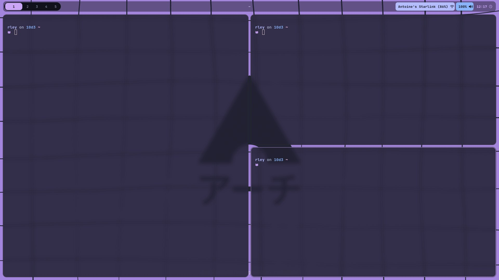
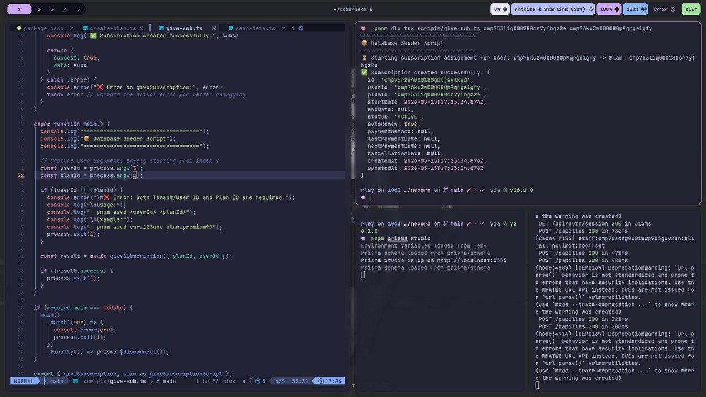
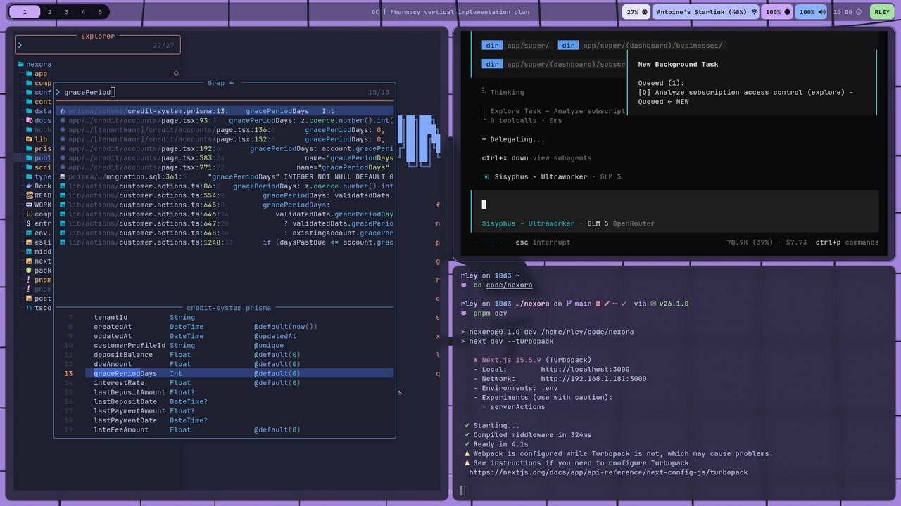

# Dotfiles

A minimal, styled dotfiles collection for Hyprland, Kitty, Rofi, Neovim, and related tools.

**Status:** Work in progress — I just began this collection and haven't finished it yet, and I don't have time to complete it right now.

**Preview**

   
   
   

   <video src="look/1.mp4" controls width="800">Your browser does not support the video tag.</video>

**About this ricing**

- **What this is:** A personal ricing/dotfiles collection focused on aesthetics and usability for Hyprland, the Kitty terminal, Rofi launcher, and Neovim.
- **Quick note:** This repo is early-stage — configs are usable but not fully polished.

**What you'll find**

- **hypr/** — Hyprland compositor configs, wallpaper settings, lockscreen image, and useful helper scripts for screen recording and session controls.
- **kitty/** — `kitty.conf` plus adaptive theme variants (dark, light, no-preference).
- **rofi/** — Rofi theme and launcher customizations.
- **nvim/** — A LazyVim-based Neovim setup with local plugin and keymap tweaks in `lua/config/`.
- **opencode/** — OpenCode/OpenAgent configs for AI tooling and custom skills.

**Usage (quick start)**

1. Copy or symlink folders to your config locations (example):

    - `~/.config/hypr/` — for Hyprland
    - `~/.config/kitty/` — for Kitty
    - `~/.config/rofi/` — for Rofi
    - `~/.config/nvim/` — for Neovim

2. Install required tools: Hyprland, Kitty, Rofi, Neovim, plus any helpers referenced in the `hypr/scripts/` folder.

3. Tweak fonts, icon themes, and the wallpaper path to match your system.

**Opencode / AI tooling**

This repository also contains an `opencode/` folder with OpenCode/OpenAgent config and skills to help automate or document custom tasks. See `opencode/` for details and examples.

**Files of interest**

- [hypr/hyprland.conf](hypr/hyprland.conf) — main Hyprland settings
- [kitty/kitty.conf](kitty/kitty.conf) — terminal setup and theme includes
- [rofi/config.rasi](rofi/config.rasi) — Rofi theme
- [nvim/init.lua](nvim/init.lua) — Neovim bootstrap
- [opencode/opencode.json](opencode/opencode.json) — OpenCode config
- [look/1.jpg](look/1.jpg), [look/2.jpg](look/2.jpg), [look/3.jpg](look/3.jpg), [look/1.mp4](look/1.mp4)

**Next steps & how you can help**

- Polish Hyprland section and document key options in `hypr/hyprland.conf`.
- Add installation scripts or a setup checklist for new machines.
- If you have feedback or want to contribute aesthetics or fixes, open an issue or PR.

---

If you'd like, I can:

- expand the `hypr/` documentation with annotated snippets,
- add a small install script to bootstrap configs,
- or create a dedicated gallery page for more photos/videos.

See the README and media files in this repo to preview the ricing: [README.md](README.md) — the gallery uses `look/` media already included.
